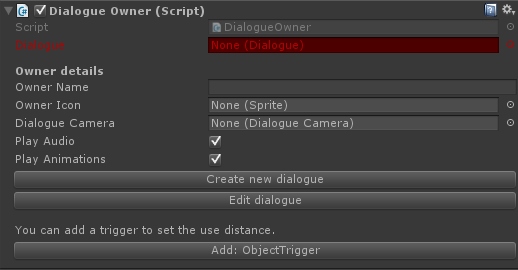

# Dialogue Getting Started

## 1. Managers

If you don't already have a managers object create one first. A simple empty object will suffice.

On the managers object add the "DialogueManager" component. The DialogueManager has a single reference to the DialogueUI component, which we will add later.

## 2. Adding the Dialogue UI

To display the dialogue to the player we'll haev to add teh Dialogue UI. You can grab the default dialogue UI component from:  **Devdog / QuestSystemPro / Designs / RPGStyle / WindowPrefabs / Dialogue_PFB.** Drag this prefab into your canvas and link it in the DialogueManager component created in step 1.

## 3. Creating the dialogue owner

To trigger a dialogue we can use a dialogue owner, this is the 'npc' that owns this dialouge. Simply create a new object (for example a cube) and place it in the world.

Note that the DialogueOwner either must have a collider OR an object trigger that triggers the dialogue owner when you come into range.

On the DialogueOwner you'll see a red field "Dialogue". The dialogue field is required and can not be empty.

At the bottom of the component there's a button "Create new dialogue". This will create a new dialogue and link it directly to this dialogue owner, and finally open the dialogue editor.

## 4. Creating the dialogue

[How to use the dialogue editor](DialogueEditor.md) is covered here.