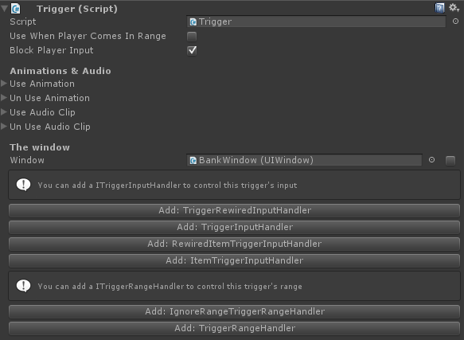

# Triggers

Object triggers can be used to trigger a window and bound them to a location in the world. For example, when the player opens a bank it is done so at a specific location in your game. When the player walks away the bank window will auto. be closed and won't be able to be re-opened until the player is in range of the bank again.

!!! note
	The main camera requires a `PhysicsRaycaster` with the "Ignore Raycasts" layer disabled for trigger clicks to get detected.

!!! note
	The trigger distance can be managed in the general settings object.

-   **Trigger mouse click** activates the window when the triggerer is clicked.
-   **Trigger hover key code** triggers the window when the object is in the center of the screen and the keycode is pressed (useful for first person games).
-   **The animations and audio** clips are for the object that triggers the window (such as a NPC), not the window itself.

**ITriggerInputHandler:** The Input handler is responsible for handling the input of the trigger. This allows you to replace just the input if you'd like to use your own system. If you're using an asset like Rewired you can simply swap out the input handler for a rewired input handler, and voila, the trigger is now using rewired's input system.

**ITriggerRangeHandler:** The range handler handles the range for this trigger. When none is set the player's range handler is used by default. If you'd like to create an object which has a different range than the global use distance (the distance your player's trigger is using), you can do so by adding the TriggerRangeHandler and specifying the use distance on the newly added component.

**Note:** **you don't have to use a trigger range handler on a component, by default your player's range handler is used.**

### 2D Triggers

When building a 2D game make sure to attach a 2D trigger to the Trigger component, and make sure to set up the player for 2D use.

### Player2D

You have to change the Player component for a Player2D component. All components suffixed with "2D" are for 2D use only, while some components with no suffix can be used in either 2D or in 3D (for example, the Trigger).

Triggers respond to the player coming in range. When using a 2D player object the triggers have to have a 2D trigger or collider component to be detected.